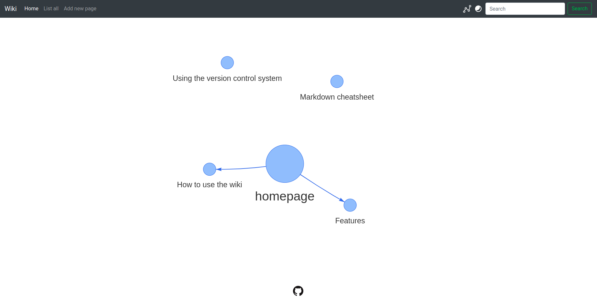

# wikmd

> :information_source: **Information** can be found in the docs: [https://linbreux.github.io/wikmd/](https://linbreux.github.io/wikmd/)


## What is it?

It's a file-based wiki that aims to simplicity. The documents are completely written in Markdown which is an easy markup language that you can learn in 60 sec.

## How does it work?

Instead of storing the data in a database I chose to have a file-based system. The advantage of this system is that every file is directly readable inside a terminal etc. Also when you have direct access to the system you can export the files to anything you like.

To view the documents in the browser, the document is converted to html.

## Features

- knowledge graph
- git support (version control)
- image support including sizing and referencing
- math/latex
- code highlight
- file searching
- file based
- dark theme
- codemirror for editing

## Installation

Detailed installation instruction can be found [here](https://linbreux.github.io/wikmd/installation.html).

## Knowledge graph (beta)

More info can be found in the [docs](https://linbreux.github.io/wikmd/knowledge%20graph.html).



## How to use wikmd

[Using the wiki](https://linbreux.github.io/wikmd/Using%20the%20wiki.html)

## Chat with AI Assistant

A new chat feature has been added to the wiki that allows you to:

- Search for notes using natural language
- Create new notes through conversation
- Get assistance with wiki-related tasks

The chat interface uses the OpenAI Agents SDK to provide a streaming, interactive experience with tool calling capabilities for direct integration with the wiki.

### Setup

To use the chat feature, you need to set up an OpenAI API key in your environment:

```bash
export OPENAI_API_KEY="your-api-key-here"
```

### Features

- Real-time streaming responses
- Markdown rendering in chat
- Tool usage visibility
- Mobile-responsive design
- Dark mode support

### Usage

Click on the "Chat" link in the navigation bar to access the chat interface.

Example queries:

- "Find notes about dragons"
- "Create a new note about elven culture"
- "What topics are available in this wiki?"
